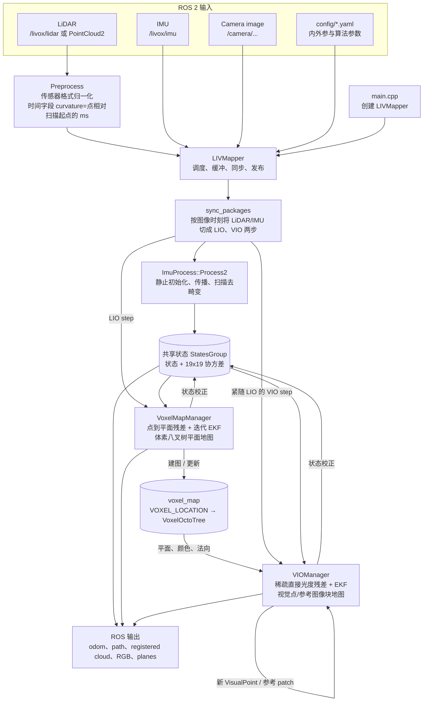
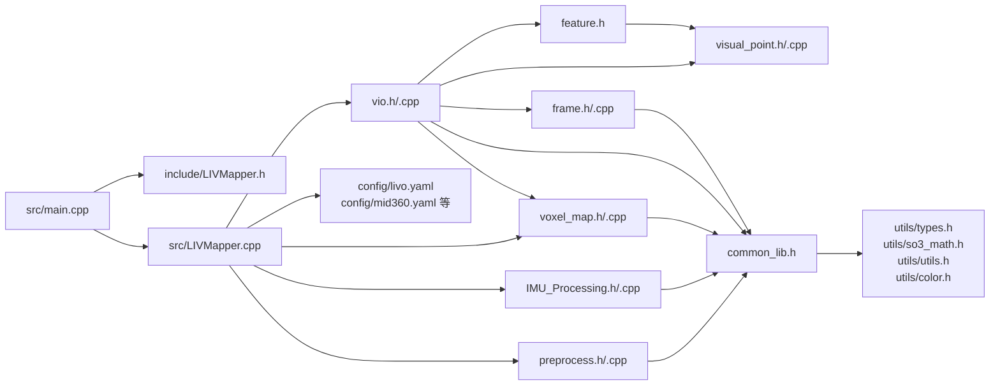

# FAST-LIVO2：LIVO 算法代码阅读指南

> 范围：本文只解释本包 `src/FAST-LIVO2` 中的 FAST-LIVO2 **LiDAR–IMU–Visual Odometry（LIVO）** 主算法。ROS2、Livox 驱动、Vikit、PCL、OpenCV、Sophus 等只作为外部依赖出现；不展开其他工作空间包、建图后处理脚本或硬件驱动。
>
> 代码版本依据：当前工作区代码。与论文的对应关系建议以 `README.md` 所链接的 FAST-LIVO2 论文为理论主线，以本文所列函数为实现主线。

## 1. 一句话理解

FAST-LIVO2 维护一个带协方差的 19 维误差状态 `StatesGroup`。IMU 为状态提供高频预测并消除 LiDAR 扫描内畸变；LiDAR 通过自适应体素平面地图提供点到平面几何约束；相机则从同一体素地图取出可见平面点，构造稀疏直接法的图像块光度约束。二者都回写同一份状态，因此是紧耦合，而不是串联的“LIO 后再跑 VO”。

状态定义在 `include/common_lib.h`：

```
x = [ δθ(3), δp(3), δ inverse_exposure(1), δv(3), δbg(3), δba(3), δg(3) ] = 19
```

名义量存于 `StatesGroup`：`rot_end, pos_end, vel_end, bias_g, bias_a, gravity, inv_expo_time, cov`。其中状态的时间参考是当前 LiDAR 处理时刻（或为图像时刻切分后的 LIO 更新时刻）。

## 2. 总体软件系统框图



### 每个图像时刻的实际时序

LIVO 模式不是“收到一帧图像，只处理那帧图像”。`sync_packages()` 采用交替状态机：

```text
WAIT 或上一次 VIO
  └─ 取下一张图像的时间 t_img
     └─ 收集 (last_lio_update_time, t_img] 的 IMU
     └─ 将跨越 t_img 的 LiDAR 点拆成 pcl_proc_cur / pcl_proc_next
     └─ Process2：预测 + 去畸变；handleLIO：几何 EKF + 更新体素地图
        └─ 标记为 LIO

上一次 LIO
  └─ 取刚才对应图像
     └─ Process2：此步通常没有新 IMU，只保持已更新状态
     └─ handleVIO：直接光度 EKF + 更新视觉点和参考 patch
        └─ 标记为 VIO，开始等下一张图像
```

这段逻辑在 `src/LIVMapper.cpp::sync_packages()`；它是读懂“为什么 LIO 和 VIO 会交替调用”的关键。`common.img_en=0` 时模式退化为 `ONLY_LIO`；`imu_en=0` 时则为 `ONLY_LO`。请注意当前 `config/livo.yaml` 的 `img_en: 1` 才会跑完整 LIVO，配置中注释若与实际值冲突，以 YAML 的实际值和运行时参数为准。

## 3. 文件关系图



| 文件 | 角色 | 最重要的读法 |
|---|---|---|
| `src/main.cpp` | ROS 入口 | 只做节点生命周期：构造、订阅发布、`run()`。 |
| `include/LIVMapper.h` / `src/LIVMapper.cpp` | 总控器 | 首先读这里，沿 `run → sync_packages → processImu → handleLIO/handleVIO` 下钻。它拥有缓冲、三个核心模块与共享 `_state`。 |
| `include/common_lib.h` | 领域公共模型 | 先建立坐标、时间与 19 维状态的心智模型；`LidarMeasureGroup` 是同步器和 IMU 处理器之间的协议。 |
| `preprocess.*` | LiDAR 前端 | 将 AVIA、Velodyne、Ouster 等统一为 `PointCloudXYZI`；`curvature` 被复用为点相对扫描起点的毫秒偏移。 |
| `IMU_Processing.*` | 预测与去畸变 | `IMU_init` 初始化重力/噪声/偏置，`UndistortPcl` 将点云反向补偿到统一时刻。 |
| `voxel_map.*` | LIO 后端与几何地图 | 八叉体素内拟合平面，找点面对应，迭代 EKF 校正位姿，随后更新地图。 |
| `vio.*` | 视觉直接法后端 | 用 LiDAR 体素平面为几何先验，从图像块的光度误差计算雅可比并更新相同 EKF 状态。 |
| `frame.*`、`feature.h`、`visual_point.*` | 视觉数据模型 | `Frame` 管图像金字塔和位姿；`Feature` 是一次像素观测；`VisualPoint` 是世界点及其多帧观测/参考 patch。 |
| `config/*.yaml` | 算法实例化 | 传感器话题、内外参、噪声、体素与图像 patch 参数。读算法时要同时对照。 |

## 4. 三条数据链及其交汇点

### 4.1 LiDAR 链

`livox_pcl_cbk/standard_pcl_cbk` → `Preprocess::process` → `lid_raw_data_buffer` → `sync_packages` → `ImuProcess::UndistortPcl` → 体素下采样 → `VoxelMapManager::StateEstimation` → `UpdateVoxelMap`。

`StateEstimation()` 的内部顺序：

1. `calcBodyCov()` 计算各点量测不确定性，并构建外参后的叉乘矩阵。
2. 以当前预测状态将点变到世界系。
3. `BuildResidualListOMP()` 在八叉体素平面地图中并行寻找有效点面残差。
4. 用残差、平面方差、点方差组成量测权重和雅可比，迭代更新前 6 个可观位姿分量，同时以完整 19 维协方差完成滤波更新。
5. 根据最终状态重新计算点的世界位置及方差，`UpdateVoxelMap()` 插入/细分/更新平面。

### 4.2 IMU 链

`imu_cbk` → `imu_buffer` → `sync_packages` 按 LIO/VIO 时刻切片 → `Process2`。

首次若干帧由 `IMU_init()` 用均值加速度估计重力和噪声；初始化完成后 `UndistortPcl()` 在每个点的相对时间上积分 IMU，生成去畸变点云。另有 `imu_prop_callback()` 用最新一次 EKF 状态向前积分并发布高频 `/LIVO2/imu_propagate`，它只影响输出，不替代主优化。

### 4.3 视觉链

`img_cbk` → `img_buffer` → `sync_packages` → `VIOManager::processFrame()`：

1. 调整图像到 Vikit 相机模型的尺寸，转灰度，创建 `Frame` 和图像金字塔。
2. `retrieveFromVisualSparseMap()` 从 LiDAR 体素地图选择当前视野内、有平面法向和深度先验的点，建立可投影的视觉子图。
3. `computeJacobianAndUpdateEKF()` / `updateState()` 在多层金字塔上比较参考 patch 与当前 patch，构建光度残差和对状态的雅可比，校正共享 `StatesGroup`。
4. `generateVisualMapPoints()`、`updateVisualMapPoints()`、`updateReferencePatch()` 添加新视觉点、管理观测和参考 patch。

**关键交汇**：LiDAR 并不只给 VIO 一个初值；`VoxelMapManager` 的 `voxel_map_` 被直接传给 `VIOManager::processFrame()`。视觉点的深度/法向来自 LiDAR 平面地图，视觉更新又直接修改 `_state`，下一轮 LiDAR 立刻使用该状态。这正是本包“紧耦合”的实现证据。

## 5. 推荐阅读顺序（分阶段）

每一阶段结束时先画出输入、输出和“谁修改 `_state`”，再进入下一阶段；不要一开始逐行阅读 `vio.cpp` 或 `preprocess.cpp` 的所有传感器分支。

### 阶段 0：建立运行场景（约 30–60 分钟）

读 `README.md`、`CMakeLists.txt`、`launch/mapping.launch.py` 和实际使用的 YAML（通常 `config/livo.yaml`，也可能是 `mid360.yaml` / `d405.yaml`）。确认：话题名、`img_en/lidar_en/imu_en`、三组外参、相机模型命名空间、时间偏移和体素参数。

产出：手写出本机的变换链。代码中 LiDAR 点到世界系的典型形式为

```text
p_w = R_wi · (R_il · p_l + t_il) + p_wi
```

其中 `extR/extT` 是 LiDAR 到 IMU 的外参；相机外参在 `VIOManager` 中以 `T_cl`（LiDAR 到 camera）配置。不要凭变量名猜坐标方向，务必核对 YAML 注释与 `setLidarToCameraExtrinsic()`。

### 阶段 1：读总控和时间同步（约 1–2 小时）

顺序：`main.cpp` → `LIVMapper.h` → `LIVMapper.cpp` 中构造函数、`initializeComponents()`、各 callback、`run()`、`sync_packages()`、`processImu()`、`stateEstimationAndMapping()`。

重点不是发布函数，而是四个缓冲队列：`lid_raw_data_buffer`、`imu_buffer`、`img_buffer` 及对应时间队列；理解 LIVO 为什么是“一次 LIO，紧接一次 VIO”。此时可跳过 `publish_*`、`savePCD()` 和日志代码。

### 阶段 2：读状态和 IMU（约 2–4 小时）

顺序：`common_lib.h` 中 `StatesGroup`、`MeasureGroup`、`LidarMeasureGroup` → `IMU_Processing.h` → `IMU_Processing.cpp` 的 `IMU_init`、`Process2`、`UndistortPcl`。

检查每一个状态分量在 `operator+` 中的索引；理解姿态是在 SO(3) 上以 `Exp()` 增量更新。读完应能解释：为何只要 IMU 积分到扫描末端/图像时刻之后，去畸变才能开始；以及为何 LIO、VIO 都能使用同一预测状态。

### 阶段 3：读 LiDAR 几何后端（约 3–6 小时）

顺序：`voxel_map.h` → `VoxelMapManager::StateEstimation` → `BuildResidualListOMP` / `build_single_residual` → `BuildVoxelMap` / `UpdateVoxelMap` → 最后读 `VoxelOctoTree::init_plane`、`UpdateOctoTree`。

将这阶段视为 FAST-LIO 的主干：先明白“点面残差如何修正状态”，再看“平面如何在自适应八叉树中被维护”。平面方差、点方差和 `R_inv` 是理解鲁棒性与权重的重点。

### 阶段 4：读视觉直接法（约 4–8 小时）

顺序：`frame.h/.cpp` → `feature.h`、`visual_point.h/.cpp` → `vio.h` → `VIOManager::initializeVIO`、`processFrame` → `retrieveFromVisualSparseMap` → `computeJacobianAndUpdateEKF` → `updateState`（或 `updateStateInverse`）→ 视觉地图增量函数。

先顺着 `processFrame()` 的调用顺序阅读。等理解“从体素平面取点—投影—warp patch—光度残差—EKF 更新”后，才深入 `getWarpMatrixAffine*`、`warpAffine`、NCC、raycast 与 inverse composition 等优化开关。

### 阶段 5：回到端到端验证（约 1–2 小时）

打开 `config/log.yaml` 中有用的日志，或在调试器中观察：同步后的 `lio_vio_flg`、`measures.back().lio_time/vio_time`、去畸变点数、有效点面数、`vio_manager->total_points`、状态与协方差对角线。之后再读 `Preprocess` 中**正在使用的雷达型号 handler**；其他型号分支可按需阅读。

## 6. 容易迷失的边界与阅读提示

- `LIVMapper` 同时是 ROS 适配层和算法编排层，文件较大。先跟主调用链，不要被 `publish_*`、文件保存、兼容性判断分散注意力。
- `curvature` 在本工程的 `PointType` 中承载的是点的时间偏移（毫秒），不是传统点云曲率。这个约定贯穿预处理、同步和去畸变。
- `VoxelMapManager::state_` 是 `_state` 的工作副本：`handleLIO()` 先将预测状态交给它，`StateEstimation()` 更新后再赋回 `_state`。相机模块则持有 `_state` 和 `state_propagat` 的指针。
- 视觉中的 `feat_map` 和 LiDAR 的 `voxel_map_` 名称容易混淆：传入 VIO 的是**LiDAR 平面体素地图**；VIO 自己另有 `VIOManager::feat_map`，其中保存 `VisualPoint` 容器。
- `config/livo.yaml` 的 `T_cl` 使用行主序 4×4 变换，注释明确 `p_c = R_cl p_l + P_cl`。外参错误时，视觉直接法即使不崩溃也通常无法收敛。
- `CMakeLists.txt` 里的库边界可作为模块边界：`pre`、`imu_proc`、`lio`、`vio`、`laser_mapping`（`LIVMapper`）。

## 7. 最小“索引卡”

当再次进入代码时，可从下列锚点快速恢复上下文：

```text
main.cpp
  └─ LIVMapper::run()
      ├─ sync_packages(LidarMeasures)
      ├─ processImu()                 -> ImuProcess::Process2()
      └─ stateEstimationAndMapping()
          ├─ handleLIO()              -> VoxelMapManager::StateEstimation()
          │                              -> UpdateVoxelMap()
          └─ handleVIO()              -> VIOManager::processFrame()
                                         -> computeJacobianAndUpdateEKF()
```

如果只剩一小时，读阶段 1 的同步状态机、阶段 2 的 `StatesGroup`/`Process2`、阶段 3 的 `StateEstimation`、阶段 4 的 `processFrame` 即可建立正确的全局模型；其余函数都是对这四个锚点的具体实现、传感器适配或性能优化。
